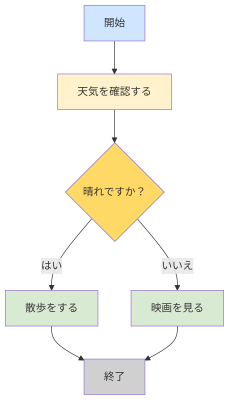

##  アルゴリズムとは
-  問題を解決する手順のこと
  - （例）カップラメーンを作るには？
    - 順次プログラム
  - ただし、現実は一本道ではなく、晴れたら洗濯するなど、条件によって行動が変わる
    - 条件によって処理が変わることを「分岐」という

  
## フローチャート
- 分岐のある手順は、図で表すと分かりやすい
- フローチャートとは、いくつかの記号を用いてアルゴリズムを表すもの



- よく使う共通記号

| 記号   | 意味       |
| ------ | ---------- |
| 楕円   | 開始・終了 |
| 長方形 | 処理       |
| ひし形 | 条件分岐   |
| 矢印   | 流れ       |

### フローチャートを書くツール
  - draw.io（diagrams.net）[https://app.diagrams.net/](https://app.diagrams.net/)
  - https://www.mermaidonline.live/

####  mermaid: 文字だけで図やフローチャートを書ける記法
```
flowchart TD

A[開始] --> B[天気を確認する]
B --> C{晴れですか？}

C -->|はい| D[散歩をする]
C -->|いいえ| E[映画を見る]

D --> F[終了]
E --> F
```


=> **プログラムの作成は、アルゴリズムをコンピュータが実行できる形で記述すること**


## if文
```
if (条件式){
  条件成立のときに実行する処理
} else {
  条件不成立のときに実行する処理
}
```

```java
public class Main {
    public static void main(String[] args) {
        boolean tenki = true;
        if (tenki == true) {
            System.out.println("散歩をする");
        } else {
            System.out.println("映画をみる");
        }
    }    
}
```

### 条件式とは
- if文で利用する式の１つ
- 処理を分岐する条件を表現するもの


| 演算子 | 意味 | 例 | 結果 |
|---|---|---|---|
| `==` | 等しい | `a == b` | aとbが同じならtrue |
| `!=` | 等しくない | `a != b` | aとbが違えばtrue |
| `>` | より大きい | `a > b` | aがbより大きければtrue |
| `<` | より小さい | `a < b` | aがbより小さければtrue |
| `>=` | 以上 | `a >= b` | aがb以上ならtrue |
| `<=` | 以下 | `a <= b` | aがb以下ならtrue |

### 例題
- 変数：scoreを宣言し、socreが８０以上なら合格と表示し、８０未満なら不合格と表示するプログラムを作成してください。


### 文字列の比較
```
文字列型の変数.equals(比較する文字列);
```

```
public class Main {
    public static void main(String[] args) {
        String answer = "はい";

        if (answer.equals("はい")) {
            System.out.println("OKが選ばれました");
        } else {
            System.out.println("OK以外が選ばれました");
        }
    }
}
```


### if文
もし雨なら傘を持っていく

```
if (条件式){
  条件成立のときに実行する処理
} 
```

```java
public class Main {
    public static void main(String[] args) {
        boolean rain = true;
        if (rain == true) {
            System.out.println("傘をもっていく");
        }
    }    
}
```

### if -else if - else文
```java
if (条件式){
  条件成立のときに実行する処理
} else if(条件式) {
  条件成立のときに実行する処理
} else {
  条件不成立のときに実行する処理
}
```

```java
public class Main {
    public static void main(String[] args) {
        int hp = 15; // hit point

        if (hp >= 80) {
            System.out.println("元気");
        } else if (hp >= 30) {
            System.out.println("弱っている");
        } else {
            System.out.println("危険");
        }
    }
}
```


## 条件式 `&&` と `||`

| 演算子 | 意味 | 例 | 結果 |
|---|---|---|---|
| `&&` | かつ（AND） | `a > 0 && a < 10` | 両方の条件がtrueならtrue |
| `\|\|` | または（OR） | `a == 0 \|\| a == 1` | どちらかがtrueならtrue |


```java
int age = 20;

if (age >= 18 && age <= 64) {
    System.out.println("大人料金です");
}
```


## swich文

## 伝統的なswitch文

## while文


## 