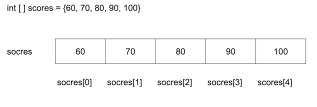
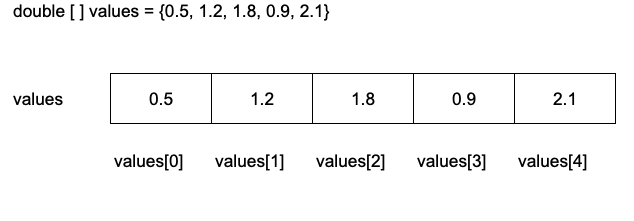

## 配列

- 1つの種類の複数のデータを並び順で格納するデータ構造
- 変数のような箱が連続して並んでいてその1つ1つを　**要素** といいます
- 要素は通常の変数のように型を持ち、１つのデータを格納できます
- 配列の各要素には0, 1, 2 と番号がついています
- この番号を**添え字** または **インデックス(index)** といいます
- インデックスは**0から始まる** 決まりになっています

## null(ヌル)
- nullは「0」でも「空文字」でもなく、「なにもない」ことを表す特別な値

## ヌル文字
- ヌル文字は「文字コード0の文字」、nullは「値が存在しない状態」です。名前は似ていますが全く別物です。
- ヌル文字 ('\u0000') は、見えないだけで「文字の一種」です。例えば「あ」や「A」と同じように、コンピュータの中では1文字として扱われます。

## 参照型
- 基本型：int
  - byte
  - short
  - int
  - long
  - float
  - double
  - char
  - boolean

- 参照型：メモリ上の番地を代入する変数のこと
  - 配列
  - String(Stringは参照型でありながら変更不可（immutable）なオブジェクト)

## Garbage Collection（ガベージコレクション）
- GCあり
  - メモリ解放を言語やランタイムが自動で行う
  - 管理が楽、不要になったメモリがすぐに解放されない、GCなしに比べて遅い
- GCなし
  - プログラマーが管理する(malloc、free)
  - 高速、メモリを細かく制御できる

| 言語                  | GC        |
| ------------------- | --------- |
| Java                | ○         |
| Python              | ○         |
| JavaScript(Node.js) | ○         |
| C#                  | ○         |
| Go                  | ○         |
| PHP                 | ○         |
| Ruby                | ○         |
| Kotlin              | ○         |
| Scala               | ○         |
| C                   | ×         |
| C++                 | ×         |
| Rust                | ×（所有権で管理） |

## ソート
ソートとは、「並べ替え」の意味です。数値データを、大きい順、もしくは小さい順に並べ替える処理のことを言います。
なお、データを小さい順に並べ替えることを、昇順（しょうじゅん）、大きい順に並べ替えることを、降順(こうじゅん)と言います。

- バブルソート