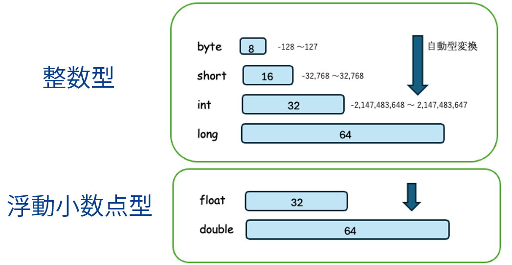

##  演算子
- 式は演算子とオペランドで構成されている
- 演算子は優先順位と結合規則に従って評価される
  - int a = 5 + 3 * 2 (優先順位)
  - inb b = 5 + 3 + 6 (結合規則)


| 優先順位 | 演算子 | 名称 | 結合規則 |
|---|---|---|---|
| 1 | `++` `--` | 後置インクリメント | 左→右 |
| 2 | `++` `--` | 前置インクリメント | 右→左 |
| 3 | `(型)` | キャスト（型変換） | 右→左 |
| 4 | `*` `/` `%` | 乗算<br>除算<br>剰余 | 左→右 |
| 5 | `+` `-` | 加算<br>減算 | 左→右 |
| 5 | `+` | 文字列連結 | 左→右 |
| 15 | `=` | 代入演算子 | 右→左|
| 15 | `+=` `-=` `*=` `/=` `%=` | 複合代入演算子 | 右→左|


## リテラル
- リテラル(具体的な値）にも型があり、記述方式で型が決まる
  - 30  は？　→　int
  - 1000L は？　→ Long

### エスケープシーケンス
String型やChar型のリテラル内に改行や引用符（“ や ‘ ）を表現したい場合、エスケープシーケンスを使う


| エスケープシーケンス | 意味 |
|---|---|
| `\t` または `¥t` | タブ |
| `\n` または `¥n` | 改行 |
| `\\` または `¥¥` | `\` または `¥` |
| `\"` または `¥"` | `"` |
| `\'` または `¥'` | `'` |


## 複合代入演算子

| 複合代入演算子 | 再代入の式 | 意味 |
|---|---|---|
| `n += x` | `n = n + x` | 変数 `n` の値を、`x` だけ増やす |
| `n -= x` | `n = n - x` | 変数 `n` の値を、`x` だけ減らす |
| `str += s` | `str = str + s` | 文字列 `str` に `s` を連結する |


## 型変換
- 自動型変換 (小さい型 → 大きい型は自動で変換される。)
- キャストによる型変換(大きい型 → 小さい型 は危険なので明示して変換する)




## int同士の計算
```
int x = 10 / 3;
System.out.println("xの値は=" + x);
----
xの値は=3
```

- (例)アルバイトの給料を計算するシステムで、給料(=salary)をintにすると？

```
public class Main {
    public static void main(String[] args) {
        int hourly_pay = 1000;  // 時給1,000円()
        int working_hours = (int)3.5;  //3.5時間働いた

        int salary = hourly_pay * working_hours;
        System.out.println(salary);
    }
}
```


##  命令実行の文

```
呼び出す命令の名前（引数）;
```

```java
system.out.println("Hello");
```

- 「文字を表示する命令」を呼び出している
- syste.out.println : 命令の名前
- "Hello": 引数：命令に渡すデータ

###  結果を返す命令文
```
型　変数名　= 呼び出す命令の名前（引数）;
```

```java
int m = Math.max(a, b);
```

int m:  結果を受け取る変数
  - 命令を実行し、 返ってきた結果を変数に保存する

```java
public class Main {
  public static void main(String[] args) {
    int a = 5;
    int b = 3;
    int m = Math.max(a, b);
    System.out.println("大きいほうの数字は=" + m );
  }
}
```

###  ランダムな数を生成する命令

- さいころを振ると、1-6のどれかの数字がでる。どの数字がでるかはわからない。=> ランダム

```java
public class Main {
  public static void main(String[] args) {
    int number = new java.util.Random().nextInt(10);
    System.out.println("今日のラッキーナンバーは" + number + "です！");
  }
}
```

### キーボードからの入力を受け付ける命令

```java
public class Main {
  public static void main(String[] args) {
    System.out.println("あなたの名前を入力してください");
    String name = new java.util.Scanner(System.in).nextLine();
    System.out.println("好きな数字を入力してください");
    int number = new java.util.Scanner(System.in).nextInt();
    System.out.println(name + "さんの好きな数字は" + number + "ですね。");
  }
}
```


## 参考
- API Specification には、Javaで使える便利な機能や命令の使い方が載っている
- [https://docs.oracle.com/en/java/javase/](https://docs.oracle.com/en/java/javase/)
    - JDK25(みたいversionを指定) => API Documentation => java.base => java.util => Scanner などで検索できる

- APIとは
  - 「誰かが作った便利な機能を、決められた方法で使う仕組み」
  - 自分で全部作るのではなく、 既にある便利機能を呼び出して使う
    - （例）X API, YouTube Data API